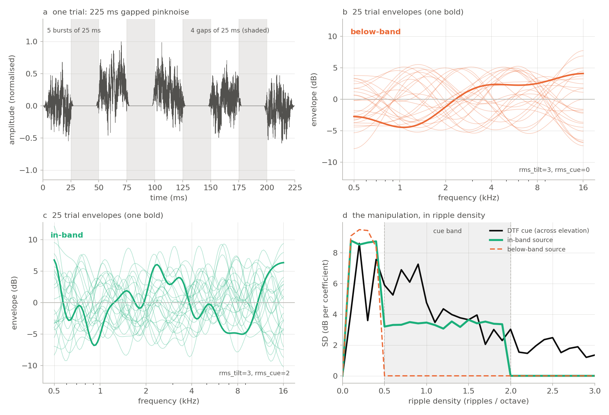
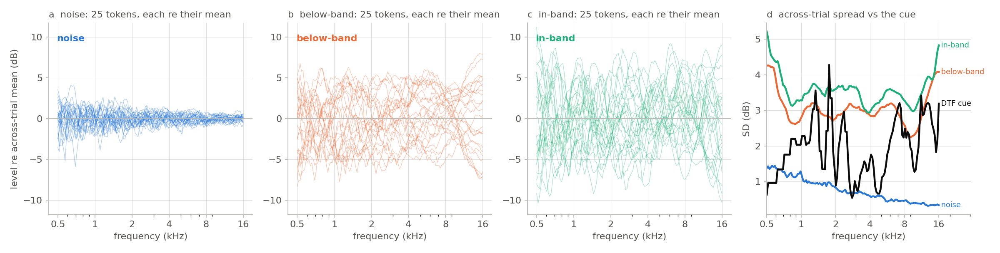
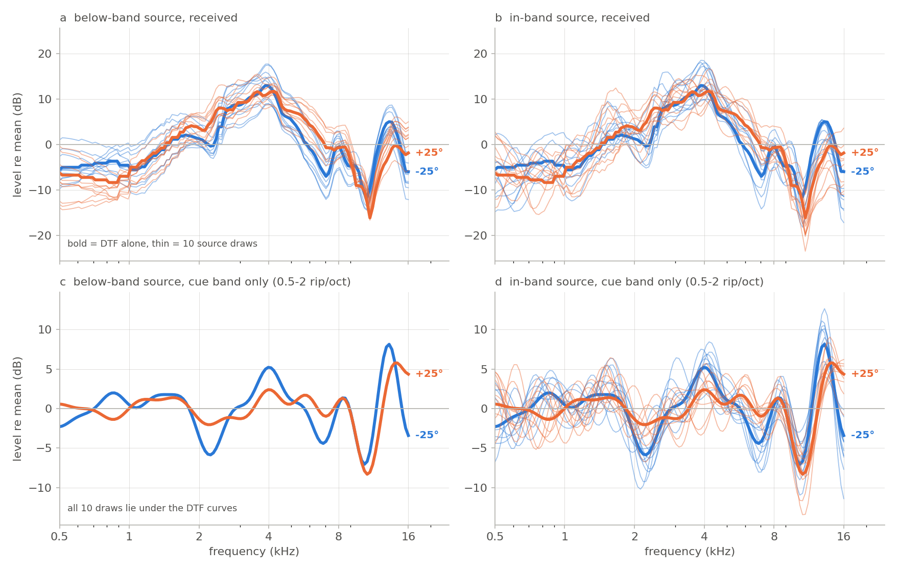

# The localization stimulus: synthesis, and what varies across trials

Companion to `stimulus.py`. Every figure here is produced by
`make_stimulus_figures.py`, which imports the real synthesis functions — the
figures cannot drift away from what the experiment actually plays. Rerun with:

```
python -m hrtf_relearning.docs.make_stimulus_figures
```

---

## 1. The carrier: a gapped pinknoise burst train

`make_gapped_pinknoise(level=80)` builds the carrier every condition shares:

1. 225 ms of pinknoise (`DURATION`), at the slab default samplerate — which
   `stimulus.py` pins to 48828 Hz at import, because slab's own default is 8000
   and a block synthesised at 8 kHz plays 6.1× fast with nothing above 4 kHz.
2. A 10 ms raised-cosine ramp at each end.
3. Four 25 ms windows zeroed at 25–50, 75–100, 125–150 and 175–200 ms, each
   edge given a 5 ms raised cosine applied ±2.5 ms about the boundary.

The result is five ~25 ms bursts separated by four gaps (figure 1a). All five
bursts are cut from **one continuous noise realisation**, so they are
independent samples of the same process.



*Figure 1. (a) One trial in the time domain; gaps shaded. (b, c) 25 trial
envelopes for the two ripple conditions, one drawn bold. (d) The same
envelopes decomposed by ripple density, against the DTF's own elevation cue.
Below 0.5 ripples/oct the two conditions are identical — they share `rms_tilt`
— so the dashed below-band trace lies on top of the in-band one there.*

## 2. The envelope: a random spectral shape, one per trial

Plain pinknoise has essentially no across-trial variation: its expected
spectrum is identical every trial and only the realisation noise differs
(figure 2a, and 0.77 dB SD measured below). `make_rippled_pinknoise` recolours
each trial with a fresh random envelope.

**The basis.** The envelope is defined on a log-frequency axis of `SHAPE_N=128`
points from `SHAPE_FLO=500` Hz to `SHAPE_FHI=16000` Hz — five octaves — and is
built as an inverse DCT-II (orthonormal) of a coefficient vector. Coefficient
*k* is a cosine with *k*/2 periods across the axis, so its **ripple density** is

```
density(k) = k / (2 · log2(SHAPE_FHI / SHAPE_FLO)) = k / 10   ripples per octave
```

Density is a property of *the axis*, not of the signal — the same DCT index
means a different density on a different frequency range. Anything comparing a
stimulus to a DTF has to put both on the same axis first; `spectral_metrics.log_axis`
exists to make that explicit.

**The band split** (`_band_indices`). With the defaults:

| band | DCT indices | density | what it is |
|---|---|---|---|
| tilt | k = 1…4 | 0.1–0.4 rip/oct | broad colouration — what natural sources differ by |
| cue | k = 5…19 | 0.5–1.9 rip/oct | where the pinna notch moves with elevation |

DC (k = 0) is always excluded, so the envelope has zero mean and imposes no
level change.

**The draw** (`_scaled`). Within a band, coefficients are drawn i.i.d. standard
normal and then rescaled so that the inverse DCT of that band has *exactly* the
requested rms in dB. Because scaling coefficients scales the inverse DCT by the
same factor, **the coefficients fully determine the shape** — which is why
logging them makes every trial exactly reconstructible after the fact
(`shape_from_coefficients`). `shape_coefficients` sums an independent draw per
band, so `rms_tilt` and `rms_cue` are set independently.

`flat_rms` is a third mode that overrides both with one i.i.d. draw across all
densities below `ripple_max`. It is **not** the same as `rms_tilt == rms_cue`:
the two bands hold 4 and 15 coefficients, so equal point-wise rms puts far more
energy per coefficient in the tilt band.

**Application.** The shape (in dB) is converted to a linear gain, interpolated
onto the FFT bin frequencies with the value **held at the edges** outside
500–16000 Hz (clipped, not rolled off), and applied zero-phase in the frequency
domain. Then the level is reset and the ramp and gaps are applied — so the
envelope is imposed **before** gapping and is therefore **shared by all five
bursts** of a trial (burst-to-burst r = 0.95 for detrended log spectra, against
−0.01 for unmodified noise). That matters: integrating across bursts averages
the realisation noise down but leaves the imposed colouration intact, so the
source spectrum is a stable property of the trial rather than per-burst noise.
It is also the knob a burst-coherence experiment would turn.

`seed=` makes a shape reproducible; `coeffs=` replays an exact one, overriding
both `seed` and the rms settings.

**What is logged**, per trial, into `sequence.stim_params`: `kind`, `mode`
(`banded` / `flat`), `rms_tilt`, `rms_cue`, `flat_rms`, `seed`, `tilt_max`,
`ripple_max`, `shape_flo`, `shape_fhi`, and `coeffs` — the first
`n_active_coefficients()` = 20 entries, i.e. the whole tilt and cue band. The
*requested* settings separately land on `sequence.stim_settings`.

## 3. The three conditions

| condition | settings | what varies across trials |
|---|---|---|
| noise | — | nothing imposed; realisation noise only |
| below-band | `rms_tilt=3, rms_cue=0` | broad colouration, outside the cue band |
| in-band | `rms_tilt=3, rms_cue=2` | the same, **plus** variation inside the cue band |

The two ripple conditions share `rms_tilt`, so the only difference between them
is the in-band component. That is deliberate: it makes the contrast a clean
one-factor comparison rather than a swap of two different stimuli.

## 4. What actually varies from trial to trial



*Figure 2. (a–c) 25 measured tokens per condition, each shown relative to the
across-token mean — the pink −3 dB/oct slope is common to every trial and is
removed so the variation is visible. (d) Across-trial SD per frequency, with
the DTF's across-elevation SD for scale.*

Note what panel (d) **cannot** show: below-band and in-band have nearly the
same SD at every frequency. A per-frequency spread does not distinguish them,
because it is blind to the spectral *scale* of the variation. Only the ripple
density view (figure 1d) shows the manipulation. This is the single most
common way to misread these stimuli.

Measured over 200 tokens each, on the stimulus's own 0.5–16 kHz axis, against
AS's left-ear midline DTF:

| condition | across-trial SD | cue:source, below 0.5 rip/oct | cue:source, 0.5–2 rip/oct |
|---|---|---|---|
| noise | 0.77 dB | 3.9 : 1 | 2.8 : 1 |
| below-band | 3.06 dB | **0.40 : 1** | **2.90 : 1** |
| in-band | 3.58 dB | 0.40 : 1 | **0.85 : 1** |

Read that middle row as the design working: below the cue band the source
dominates the cue 2.5-fold, while inside the cue band the cue still stands
nearly 3:1 clear of it. The bottom row is the manipulation: `rms_cue=2` brings
the in-band ratio to ~0.85:1 without touching anything below the band.

These ratios are on the **500–16000 Hz axis** used by the figures. The numbers
in `stimulus_check.py` and `spectral_metrics.calibrate_rms_cue` are computed on
a **3500–16000 Hz** axis and are not directly comparable; density bands are
axis-dependent. Always name the axis when quoting a ratio.

Two further caveats on the ratios. The below-band condition does not have an
*infinite* in-band ratio, because a band-limited envelope cannot have a
perfectly sharp edge at 0.5 ripples/oct — that leakage, not `rms_cue`, is the
ceiling on how far `rms_tilt` can be pushed. And the noise condition's 2.8:1 is
not an imposed source at all; it is realisation noise, which at 1/6-octave
resolution is small enough that absolute-spectrum template matching solves the
task outright.

## 5. Why in-band variation is the hard case



*Figure 3. Received spectrum = DTF + source envelope, for two midline
elevations, ten source draws each. Top row: what arrives at the eardrum.
Bottom row: the same after keeping only 0.5–2 ripples/oct — what a read-out
that simply filters by ripple density would work with. Colour encodes a signed
quantity (below vs above the horizon), so it uses the diverging pair rather
than the categorical order of figures 1 and 2.*

Panel (c) is the point. With below-band variation, band-limiting to the cue
band removes the source **completely**: all ten draws collapse onto the DTF
curve, and the two elevations separate cleanly. No inference is needed, no
prior, no interaural comparison — a filter suffices.

Panel (d) is the other point. With in-band variation the source survives the
same filter, the ten draws scatter, and the two elevations' families overlap.
Inside the cue band a source feature and a directional feature are formally
indistinguishable in a single monaural spectrum: the information is not there.
Anything that recovers direction must come from somewhere else — a prior over
source spectra, statistics accumulated across trials, integration across the
five bursts, head movement, or the interaural difference, in which the source
cancels exactly at every density.

That is why the below-band stimulus is a manipulation check and the in-band one
is the experiment. See `experiment/protocols/dev/source_spectrum_isd_design.md`.

## 6. Gotchas

- **`stimulus.py` sets the slab default samplerate at import** (48828 Hz).
  Importing it changes global state for anything synthesised afterwards.
- **`make_gapped_pinknoise` returns a bare `slab.Sound`**, not a
  `(sound, params)` tuple like `make_rippled_pinknoise`. Callers wrap it:
  `stim, params = make_gapped_pinknoise(level=80), {'kind': 'noise'}`.
- **`_apply_gaps` mutates in place.**
- **Unrecognised `stim_settings` keys are silently ignored** — there is no
  validation. Only `rms_tilt`, `rms_cue`, `flat_rms` and `ripple_max` are read
  (plus `uso_base`, AR only). A typo costs you a condition.
- **Absolute level is handled downstream**, not here: the dome uses the
  freefield speaker calibration, AR the matched pybinsim gain. The `level`
  argument only sets the WAV/DAC reference.
- **`log_spectrum` needs at least one FFT bin per smoothing window.** A 1/6-octave
  window at 500 Hz is 60 Hz wide, narrower than the 95 Hz resolution of a
  512-tap IR at 48828 Hz; the function now takes at least one bin, which is a
  no-op on the default 3.5–16 kHz axis but was returning −200 dB on the wider
  one used here.
